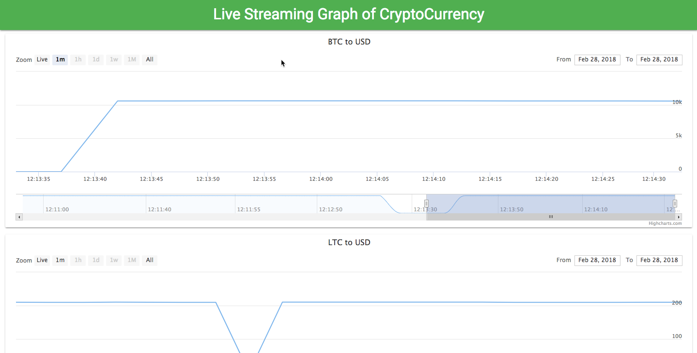

======================================
Live Streaming Graph of cryptocurrency
======================================

It's showing Bitcoin, Litecoin and Ripple currencies live data graph.

Installation
=============

   * Please make sure you already installed node and npm in your system, If not installed check below URL ::

     https://docs.npmjs.com/getting-started/installing-node

   * Clone this repository ::

      git clone https://github.com/sainipray/CryptoCurrency.git

   * install packages through npm  ::

      cd directory
      npm install

   * We need API key of https://www.coinapi.io for getting data of cryptocurrency, It can work with free account API ::

      Put apikey into config.js file in "COINAPI_KEY" in key

   * Thats it, Now you can start project using below command ::

     npm start

   * Now project will start at ::

     http://localhost:8080/

Screenshot
==========

